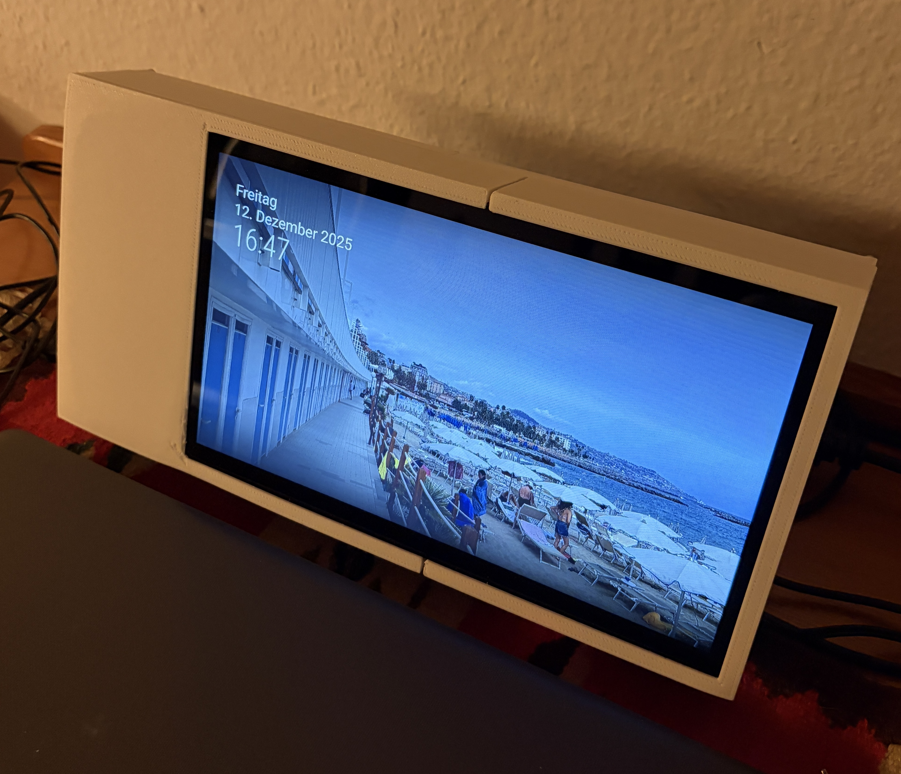

# 🖼️ MagicMirror Smart Display

Ein intelligenter Bilderrahmen mit Informationsdisplay basierend auf Raspberry Pi und MagicMirror², der automatisch zwischen Foto-Slideshow und Wetterinformationen/Nachrichten wechselt.

<p align="center">
  
  
</p>
<p align="center">
  <em>Links: Foto-Modus (StateB) | Rechts: Info-Modus (StateA)</em>
</p>

## 📋 Inhaltsverzeichnis

- [Features](#-features)
- [Hardware](#-hardware)
- [Software-Architektur](#-software-architektur)
- [Installation](#-installation)
- [Konfiguration](#-konfiguration)
- [3D-Modelle](#-3d-modelle)
- [Zeitpläne](#-zeitpläne)
- [Wartung](#-wartung)
- [Troubleshooting](#-troubleshooting)

## ✨ Features

### Display-Modi
- **📸 Foto-Modus**: iCloud-Foto-Slideshow (15 Minuten pro Foto)
- **ℹ️ Info-Modus**: Wetter, Nachrichten, Müllkalender, Regenradar
- **🔄 Automatischer Wechsel**: Alle 15 Minuten zwischen den Modi

### Intelligente Steuerung
- ⏰ **Zeitgesteuert**: Aktiv 8:00-20:00 Uhr, Standby 20:00-8:00 Uhr
- 🔌 **Display-Management**: HDMI-Steuerung für automatisches Ein-/Ausschalten
- 🔍 **Watchdog**: Automatische Neustart bei Fehlern
- 📊 **System-Monitoring**: Stündliche Status-Updates via Discord
- ☁️ **iCloud-Sync**: Täglicher Foto-Download um 7:00 Uhr

### Zusätzliche Funktionen
- 🔒 **WireGuard VPN**: Sichere Verbindung für Remote-Zugriff
- 💾 **Backup-Ziel**: 4TB HDD für Datensicherung
- 📱 **Remote-Control**: Steuerung über Webinterface (Port 8080)

## 🛠️ Hardware

| Komponente | Spezifikation |
|------------|--------------|
| **Display** | 10,1" Touchscreen (1024x600px) |
| **Computer** | Raspberry Pi 3B+ |
| **Speicher** | 4TB HDD (WD Elements) |
| **Gehäuse** | Custom 3D-gedruckt (Modelle im Repo) |
| **Stromversorgung** | USB-C Netzteil (min. 2,5A) |

### 3D-Druck Dateien
Alle STL/F3D-Dateien befinden sich im Ordner `3d_models/`:
- `Alles.stl` - Komplettes Gehäuse (All-in-One)
- `Blende_links.f3d` - Linke Rahmenblende
- `Blende_rechts.f3d` - Rechte Rahmenblende
- `Boden_links.f3d` - Linker Bodenteil
- `Boden_rechts.f3d` - Rechter Bodenteil
- `Ständer.f3d` - Standfuß

**Druckeinstellungen:**
- Layer Height: 0.2mm
- Infill: 20%
- Material: PETG oder PLA
- Support: Nur für Ständer empfohlen

## 🏗️ Software-Architektur

```
┌─────────────────────────────────────────┐
│         MagicMirror² (Node.js)          │
│  ┌────────────┐      ┌───────────────┐  │
│  │  StateA    │◄────►│    StateB     │  │
│  │ (Info)     │      │ (Photos)      │  │
│  │ 0-15, 30-45│      │ 15-30, 45-59  │  │
│  └────────────┘      └───────────────┘  │
└─────────────────────────────────────────┘
           ▲
           │
┌──────────┴──────────────────────────────┐
│   Python Scheduler (Cron: jede Min.)    │
│  • Zeitsteuerung (8-20 Uhr)             │
│  • Watchdog & Error Detection           │
│  • Display On/Off                       │
│  • Discord Monitoring                   │
└─────────────────────────────────────────┘
           ▲
           │
┌──────────┴──────────────────────────────┐
│          iCloud Photo Sync              │
│  • Täglich 7:00 Uhr                     │
│  • Download neuer Fotos                 │
│  • Bash Script + Discord Log            │
└─────────────────────────────────────────┘
```

## 📦 Installation

### 1. Raspberry Pi OS Setup

```bash
# System aktualisieren
sudo apt update && sudo apt upgrade -y

# Benötigte Pakete installieren
sudo apt install -y git nodejs npm python3 python3-pip screen wireguard

# Python-Bibliotheken
pip3 install psutil requests
```

### 2. MagicMirror² Installation

```bash
cd ~
git clone https://github.com/MichMich/MagicMirror
cd MagicMirror
npm install --only=prod --omit=dev

# Module installieren
cd modules

# MMM-BackgroundSlideshow
git clone https://github.com/darickc/MMM-BackgroundSlideshow.git

# MMM-ModuleScheduler
git clone https://github.com/ianperrin/MMM-ModuleScheduler.git

# MMM-Remote-Control
git clone https://github.com/Jopyth/MMM-Remote-Control.git
cd MMM-Remote-Control
npm install

# MMM-Regenradar
git clone https://github.com/timdows/MMM-Regenradar.git
```

### 3. Repository klonen und einrichten

```bash
cd ~
git clone <DEIN_REPO_URL> magicmirror-display
cd magicmirror-display

# Config kopieren
cp config.js ~/MagicMirror/config/config.js

# Scheduler einrichten
cp magicmirror_scheduler.py ~/magicmirror_scheduler.py
chmod +x ~/magicmirror_scheduler.py

# iCloud Script einrichten
mkdir -p ~/icloud/images
cp icloud_photo.sh ~/icloud/
chmod +x ~/icloud/icloud_photo.sh
```

### 4. Raspberry Pi Konfiguration

#### Autostart ohne Menüleiste

```bash
# Desktop-Autostart bearbeiten
sudo nano ~/.config/lxsession/LXDE-pi/autostart
```

Inhalt ersetzen mit:
```
@lxpanel --profile LXDE-pi
@pcmanfm --desktop --profile LXDE-pi
@xscreensaver -no-splash

# Bildschirmschoner & Energieverwaltung deaktivieren
@xset s off
@xset -dpms
@xset s noblank

# Desktop-Hintergrund schwarz
@pcmanfm --set-wallpaper="/usr/share/rpd-wallpaper/black.png"

# Cursor verstecken (optional)
@unclutter -idle 0.1 -root
```

#### Panel ausblenden (Menüleiste entfernen)

```bash
# Panel-Konfiguration bearbeiten
nano ~/.config/lxpanel/LXDE-pi/panels/panel
```

Ändere die Zeile:
```
autohide=1
```

### 5. Crontab einrichten

```bash
crontab -e
```

Folgende Zeilen hinzufügen:
```cron
# Scheduler jede Minute ausführen
* * * * * /usr/bin/python3 /home/pi/magicmirror_scheduler.py >> /home/pi/scheduler.log 2>&1

# iCloud Log täglich um 1:01 Uhr leeren
1 1 * * * echo > /home/pi/icloud/log.txt
```

### 6. WireGuard VPN (Optional)

```bash
# WireGuard Config erstellen
sudo nano /etc/wireguard/wg0.conf
```

Beispiel-Konfiguration:
```ini
[Interface]
PrivateKey = <DEIN_PRIVATE_KEY>
Address = 10.0.0.2/24
DNS = 1.1.1.1

[Peer]
PublicKey = <SERVER_PUBLIC_KEY>
Endpoint = <SERVER_IP>:51820
AllowedIPs = 0.0.0.0/0
PersistentKeepalive = 25
```

```bash
# Autostart aktivieren
sudo systemctl enable wg-quick@wg0
sudo systemctl start wg-quick@wg0
```

## ⚙️ Konfiguration

### Discord Webhook einrichten

1. Discord Server erstellen oder öffnen
2. Server Settings → Integrations → Webhooks → New Webhook
3. Webhook-URL kopieren
4. In `magicmirror_scheduler.py` eintragen:

```python
DISCORD_WEBHOOK = "https://discord.com/api/webhooks/DEINE_WEBHOOK_URL"
```

### iCloud-Sync konfigurieren

In `magicmirror_scheduler.py`:
```python
ICLOUD_URL = "https://deine-icloud-shared-album-url"
ICLOUD_DIR = "/home/pi/icloud/images"
```

Das Script `icloud_photo.sh` lädt automatisch neue Fotos herunter.

### MagicMirror Config anpassen

Bearbeite `~/MagicMirror/config/config.js`:

**Wichtige Einstellungen:**
- Zeile 3: `ipWhitelist` - Netzwerk-Zugriff
- Zeile 25: `apiKey` - Remote-Control API-Key
- Zeile 114: Koordinaten für Wetter (lat/lon)
- Zeile 172: Müllkalender URL

### Wallpaper platzieren

```bash
# Statisches Hintergrundbild für Info-Modus
cp image/Information.jpg ~/MagicMirror/modules/MMM-BackgroundSlideshow/wallpaper.jpg
```

## 📅 Zeitpläne

### Display-Betriebszeiten
- **08:00 - 20:00 Uhr**: Display aktiv, MagicMirror läuft
- **20:00 - 08:00 Uhr**: Display aus, System im Standby

### Mode-Wechsel (stündlich)
```
00-15 Min: StateA (Informationen)
15-30 Min: StateB (Fotos)
30-45 Min: StateA (Informationen)
45-59 Min: StateB (Fotos)
```

### Automatische Tasks
- **07:00 Uhr**: iCloud Foto-Sync
- **08:00 Uhr**: MagicMirror-Start
- **20:00 Uhr**: MagicMirror-Stop + Display aus
- **Jede Stunde (9-20 Uhr)**: System-Status zu Discord
- **Alle 5 Minuten**: Error-Check & Auto-Restart falls nötig

## 🔧 Wartung

### Logs überprüfen

```bash
# Scheduler Log
tail -f ~/scheduler.log

# MagicMirror Log
tail -f /tmp/magicmirror.log

# iCloud Sync Log
cat ~/icloud/log.txt

# System Journal
journalctl -f
```

### Screen-Session zugreifen

```bash
# MagicMirror Screen anzeigen
screen -r magicmirror

# Screen verlassen: Ctrl+A dann D
```

### Manuelles Starten/Stoppen

```bash
# Manuell starten (falls Scheduler gestoppt)
cd ~/MagicMirror
NODE_OPTIONS="--dns-result-order=ipv4first" node --run start

# Manuell stoppen
pkill -f MagicMirror
```

### Backup der HDD

Die 4TB HDD ist unter `/mnt/backup` gemountet (nach Setup):

```bash
# HDD mounten (einmalig)
sudo mkdir -p /mnt/backup
sudo mount /dev/sda1 /mnt/backup

# Auto-Mount einrichten
sudo nano /etc/fstab
# Zeile hinzufügen:
# /dev/sda1 /mnt/backup ext4 defaults 0 2
```

## 🐛 Troubleshooting

### Display bleibt schwarz
```bash
# Display manuell einschalten
echo on | sudo tee /sys/class/drm/card0-HDMI-A-1/status

# Status prüfen
cat /sys/class/drm/card0-HDMI-A-1/status
```

### MagicMirror startet nicht
```bash
# Error-Log prüfen
tail -f /tmp/magicmirror.log

# Node-Prozesse killen
pkill -9 node

# Manuell starten
cd ~/MagicMirror
npm start
```

### iCloud-Sync funktioniert nicht
```bash
# Script manuell ausführen
/home/pi/icloud/icloud_photo.sh "DEINE_ICLOUD_URL" /home/pi/icloud/images

# Log prüfen
cat ~/icloud/log.txt
```

### Discord-Benachrichtigungen kommen nicht an
1. Webhook-URL in `magicmirror_scheduler.py` prüfen
2. Internet-Verbindung testen: `ping discord.com`
3. Firewall-Regeln überprüfen

### Foto-Slideshow zeigt keine Bilder
```bash
# Bilder-Ordner prüfen
ls -lh ~/icloud/images/

# Berechtigungen korrigieren
chmod 755 ~/icloud/images
chmod 644 ~/icloud/images/*
```

## 📊 System-Monitoring via Discord

Der Scheduler sendet automatisch:
- ✅ Start/Stop-Meldungen
- 📊 Stündliche System-Stats (CPU, RAM, Disk, Temp)
- ⚠️ Error-Warnungen mit automatischem Restart
- ☁️ iCloud-Sync Status + Log

Beispiel Discord-Nachricht:
```
📊 System Status
CPU: 24.5%
RAM: 32% (512MB / 1024MB)
Disk: 45% (1.8TB / 4TB)
Temperature: 52.3°C
Uptime: 3 days, 14:23:15
MagicMirror: Running ✅
```

## 🤝 Mitwirken

Verbesserungsvorschläge und Pull Requests sind willkommen!

## 📝 Lizenz

Dieses Projekt ist unter der MIT-Lizenz lizenziert.

## 🙏 Danksagungen

- [MagicMirror²](https://github.com/MichMich/MagicMirror) - Die Basis-Software
- Alle Module-Entwickler der MagicMirror-Community
- Raspberry Pi Foundation

---

**Viel Spaß mit deinem Smart Display! 📸✨**
